# Reported environments, grouped by family

[`reported-environments.md`](./reported-environments.md) keeps every version and edition string distinct (`Ubuntu 24.04` vs `Ubuntu 22.04.5 LTS` vs `Ubuntu`), which is exhaustive but not skimmable. This page collapses version/edition variants of the *same* distro, desktop environment, and compositor into one family — `Ubuntu 24.04.2 LTS`, `Ubuntu 22.04+`, and `Ubuntu 25.x` all become `Ubuntu` — without merging genuinely distinct products into each other (Kubuntu, Pop!_OS, and CachyOS stay separate from Ubuntu and Arch Linux, since they're different distros, not versions of one).

## How this was produced

- [`scripts/group_families.py`](./scripts/group_families.py) reads [`catalog.json`](./catalog.json), strips trailing version numbers, build suffixes, `LTS` tags, parenthetical codenames, and Debian-style release-channel words (`stable`/`testing`/`sid`/`trixie`/`bookworm`/`unstable`) from each name, then unions the underlying issue/PR numbers for every string that collapses to the same base name (a plain set union, so an issue mentioning both `Fedora` and `Fedora 43` is counted once). Output: [`data/families.json`](./data/families.json).
- Grouping only applies to `distros`, `desktopEnvironments`, and `compositors` — `sessionTypes` (X11/Wayland/XWayland/XRDP) and `packageFormats` were already atomic in the source catalog.
- [`scripts/make_charts.py`](./scripts/make_charts.py) renders the charts below from `families.json` plus the raw `catalog.json` (needed for the session-type cross-cut, since sessions aren't grouped). NCL Graphite + Copper house theme, matching the style used in the NCL-CDD-0001 codebase-evolution report's chart scripts (a separate, non-public report on this same repo).
- [`scripts/fetch_issue_dates.py`](./scripts/fetch_issue_dates.py) pulls a `createdAt`/`closedAt`/`merged` record for every one of the 573 unique issue/PR numbers referenced anywhere in `catalog.json`, via the GitHub GraphQL API's `issueOrPullRequest(number:)` field, batched 50-at-a-time with query aliases (~12 requests total instead of 573). Output: [`data/issue_dates.json`](./data/issue_dates.json), keyed by issue/PR number — kept as its own file so `catalog.json`'s provenance stays untouched.
- [`scripts/make_timeseries_charts.py`](./scripts/make_timeseries_charts.py) joins `families.json`/`catalog.json` item numbers against `issue_dates.json` to render the time-series charts below — weekly for the per-family/per-format breakdowns and the opened-vs-closed chart, quarterly for the session-type share (weekly is too sparse for a 100%-stacked share). The most recent, still-accruing week/quarter is dropped from every chart so the series doesn't end on a misleading cliff.

## Distros — 96 strings collapse to 31 families

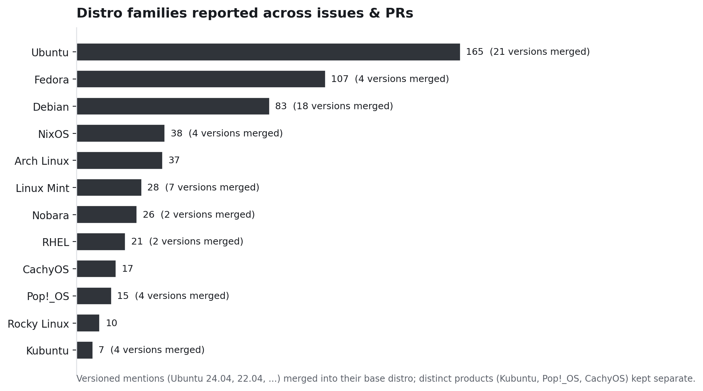

| Family | Items | Variants merged |
|---|---|---|
| Ubuntu | 165 | 21 |
| Fedora | 107 | 4 |
| Debian | 83 | 18 |
| NixOS | 38 | 4 |
| Arch Linux | 37 | 1 |
| Linux Mint | 28 | 7 |
| Nobara | 26 | 2 |
| RHEL | 21 | 2 |
| CachyOS | 17 | 1 |
| Pop!_OS | 15 | 4 |
| Rocky Linux | 10 | 1 |
| Kubuntu | 7 | 4 |
| Kali Linux | 6 | 3 |
| Bazzite | 5 | 1 |
| Gentoo | 5 | 1 |
| openSUSE | 5 | 1 |
| Fedora Silverblue | 5 | 2 |
| Omarchy | 4 | 1 |
| CentOS | 4 | 2 |
| Zorin OS | 4 | 3 |
| openSUSE Tumbleweed | 3 | 1 |
| Xubuntu | 3 | 2 |
| Manjaro | 2 | 1 |
| Ubuntu Studio | 2 | 2 |
| ArcoLinux, Armbian, Artix, Devuan, Fedora KDE, LMDE, SLES | 1 each | 1 |

`Fedora Silverblue` and `Fedora KDE` are kept separate from `Fedora` on purpose — they're distinct editions (an atomic/immutable image and a spin), not version strings of the same product.

## Desktop environments — 28 strings collapse to 8 families

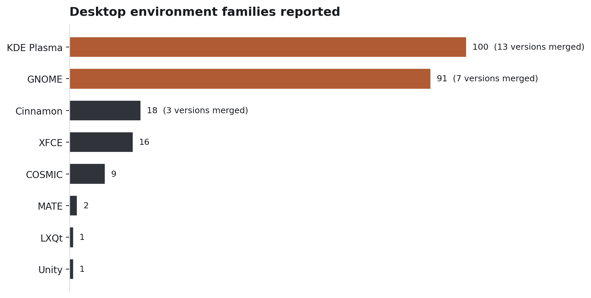

| Family | Items | Variants merged |
|---|---|---|
| KDE Plasma | 100 | 13 |
| GNOME | 91 | 7 |
| Cinnamon | 18 | 3 |
| XFCE | 16 | 1 |
| COSMIC | 9 | 1 |
| MATE | 2 | 1 |
| LXQt | 1 | 1 |
| Unity | 1 | 1 |

GNOME and KDE Plasma are within 9 items of each other once every point release is folded in — the long tail (XFCE, Cinnamon, COSMIC, MATE, LXQt, Unity) accounts for under a fifth of DE mentions combined.

## Compositors and window managers — no version variants, but a real split by kind

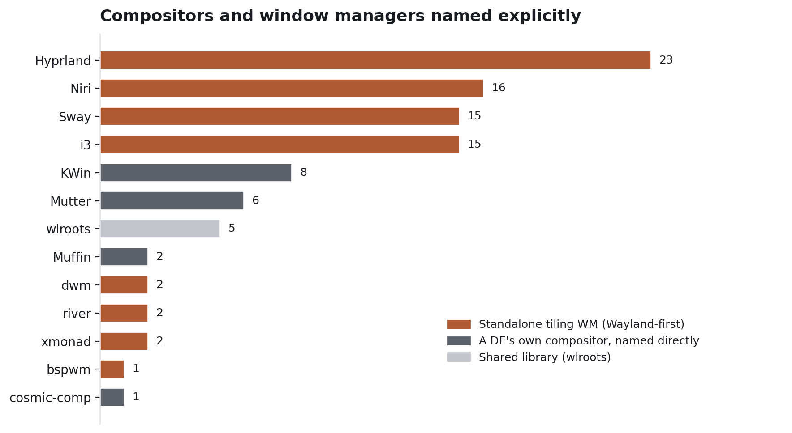

Nothing here had version strings to collapse, but grouping by *kind* is more informative than the raw list: standalone tiling compositors people chose deliberately (Hyprland, Niri, Sway, i3, dwm, river, xmonad, bspwm) outnumber every case where a reporter named their DE's own compositor directly (KWin, Mutter, Muffin, cosmic-comp) — 76 vs 17 distinct issues/PRs. Hyprland alone (23) is reported almost as often as KWin + Mutter + Muffin + cosmic-comp combined.

## Where this gets interesting: session type by environment

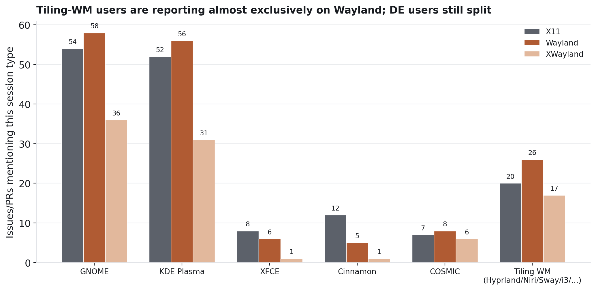

Reports aren't mutually exclusive on session type (a thread can mention both X11 and Wayland while triaging), so these are raw counts per environment, not a 100%-stacked share. The pattern still holds: GNOME and KDE Plasma users report roughly even splits across X11/Wayland/XWayland, but the standalone-tiling-WM bucket (Hyprland/Niri/Sway/i3/dwm/river/xmonad/bspwm) is Wayland-first by a wide margin, with X11 appearing mostly through XWayland compatibility rather than a native X11 session. That lines up with [`linux-topbar-shim.md`](../../../learnings/linux-topbar-shim.md) and [`wayland-global-shortcuts-portal.md`](../../../learnings/wayland-global-shortcuts-portal.md): the tiling-WM population is exactly the segment most exposed to Wayland-specific gaps (global shortcuts, XWayland-only window matching) that the DE-heavy population mostly doesn't hit.

## Package formats vs. install channels

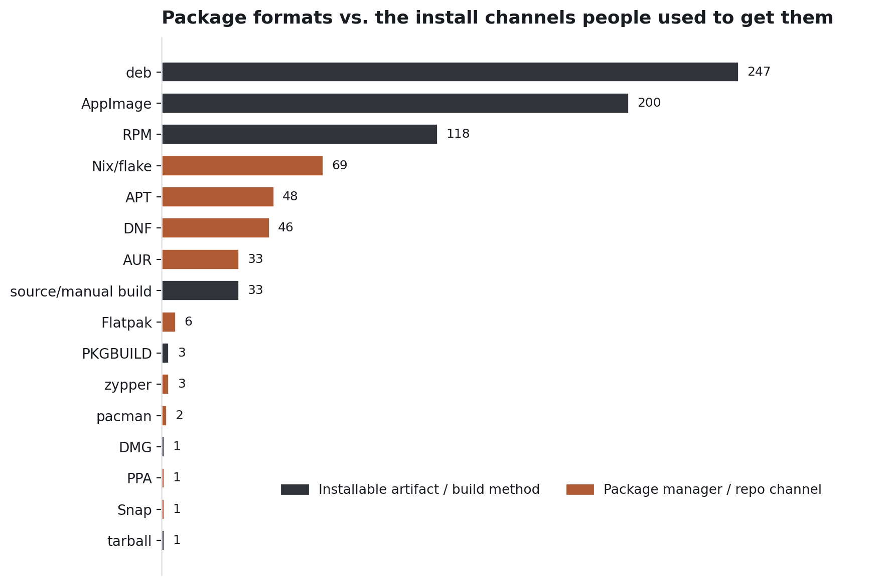

Splitting the 18 `packageFormats` strings into the artifact/build method (`deb`, `AppImage`, `RPM`, `source/manual build`, ...) versus the channel used to fetch it (`APT`, `DNF`, `AUR`, `Nix/flake`, ...) shows the `.deb` and `AppImage` formats dominate report volume, while `Nix/flake` is the single largest *channel* mentioned — ahead of `APT` and `DNF` individually, despite NixOS being a fraction of the distro-family count. Nix users are disproportionately vocal relative to their distro share, consistent with the Nix packaging surface ([`nix.md`](../../../learnings/nix.md)) being one of the more actively maintained and discussed parts of the project.

## Reports over time

All time-series charts bin by week (Monday-anchored) and drop the current, still-accruing week so the series doesn't end on a misleading cliff. The per-category charts below plot a 4-week trailing average per top family alongside the category's own total (raw weekly bars + its own 4-week average, in black), rather than a stacked area — with 5+ overlapping families a stack hides individual trends behind cumulative totals, where separate lines show each family's own trajectory directly.

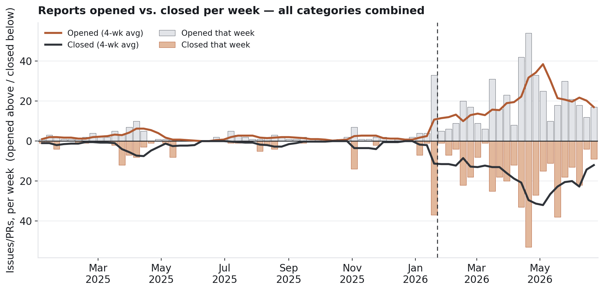

Total report volume (all categories combined, by the date the issue/PR was opened or closed) is flat and sparse through most of 2025, then breaks upward right around the same **sustained AI-assisted build-out begins (Jan 2026)** inflection point identified in the NCL-CDD-0001 codebase-evolution report — weekly opens go from single digits to a 20-55/week range by spring 2026. Closes track opens with a lag rather than keeping pace: the closed line sits visibly below the opened line for most of 2026, meaning the open backlog of environment-tagged issues/PRs has been net growing since the ramp began, not just the intake rate.

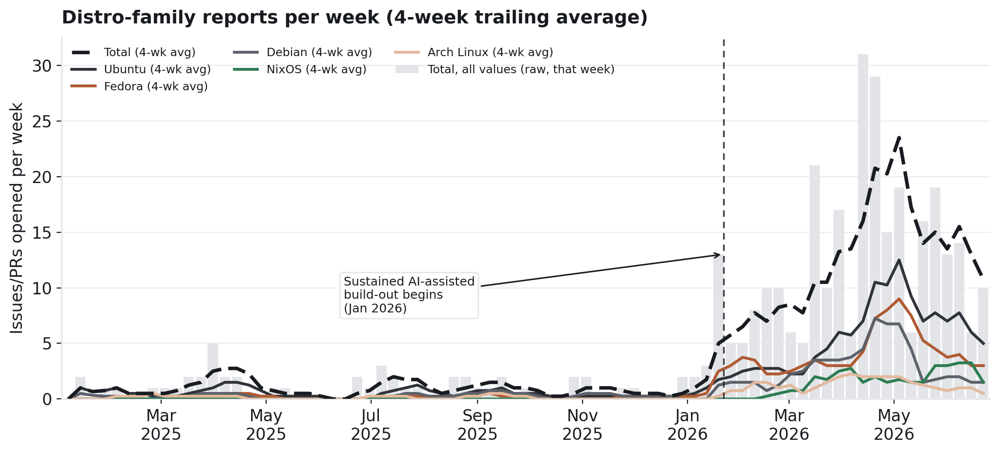

The same ramp shows up per distro family. Ubuntu's trailing average pulls ahead of Fedora and Debian from around March 2026 onward rather than all three scaling in lockstep, but no family's growth comes at another's expense — they all trend up together, just at different slopes.

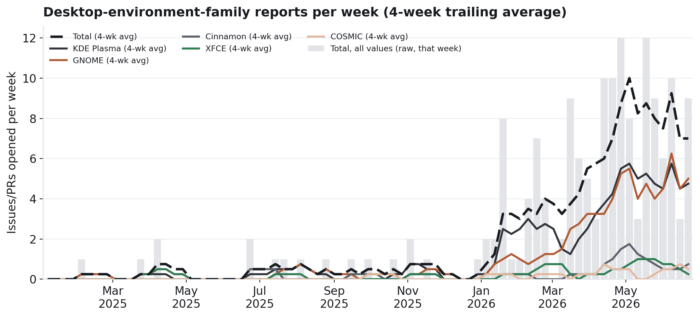

GNOME and KDE Plasma trade the lead back and forth through the ramp (KDE ahead into February 2026, GNOME ahead by June), while XFCE/Cinnamon/COSMIC stay near-flat throughout — the long tail isn't growing with the project, it's a fixed small trickle.

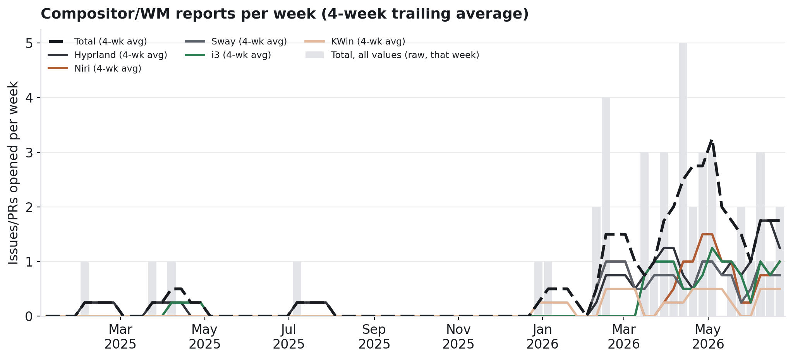

Hyprland's average overtakes the pack by May 2026 after tracking closely with Niri/Sway/i3 for most of the ramp — the standalone-tiling-WM population isn't just larger in the all-time totals shown earlier, it's also the fastest-growing individual compositor in recent months.

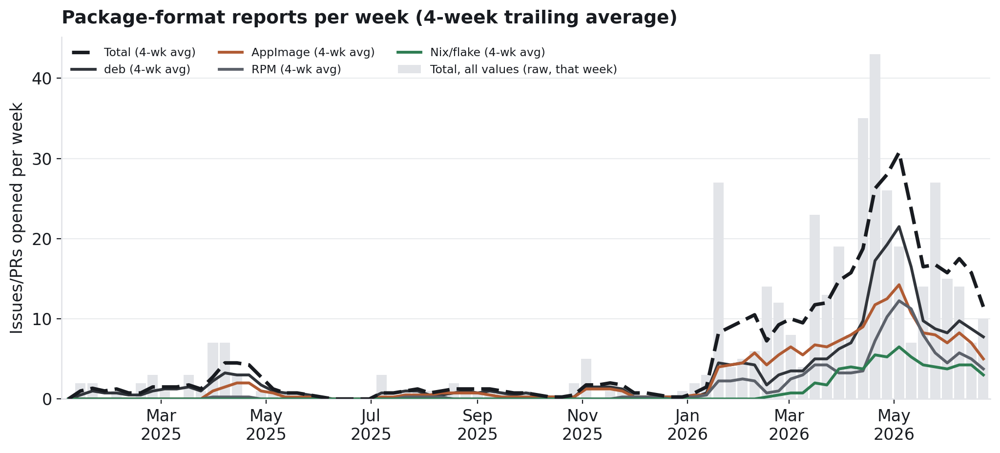

`deb` and `AppImage` scale with total volume as expected and stay the two largest lines throughout. `Nix/flake` (green) is consistently the smallest of the four shown, but its line still climbs through the ramp rather than staying flat — a real, if modest, part of the same growth.

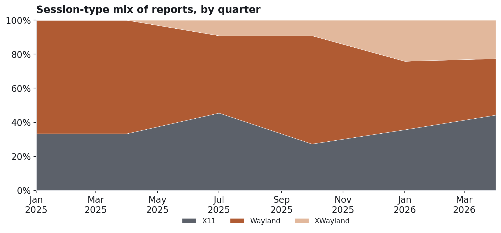

Quarterly session-type share is noisy early on (small denominators in 2025) and X11 vs. native-Wayland keep trading places quarter to quarter, but one trend is monotonic: the `XWayland` share (Wayland running the app through X11 compatibility rather than a native session) grows from effectively 0% before mid-2025 to roughly a quarter of all session-type mentions by 2026 — a compatibility layer, not a native session, becoming a durable chunk of how people actually run this app.

## Caveats

Same caveats as [`reported-environments.md`](./reported-environments.md) apply: counts are item-level presence (not weighted by repetition within a thread), some distro entries come from CI base images rather than a human's desktop, and GNOME/Mutter or KDE Plasma/KWin overlap is expected since a reporter can name both.

The time-series charts bucket by each issue/PR's *creation* date, not the date the environment was actually mentioned — the original extraction scanned bodies and comments together, so a mention added in a comment months after opening is still dated to the thread's creation. This is a reasonable proxy (most environment details land in the opening post) but not exact.
